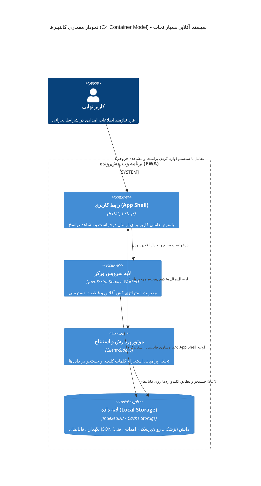

# مستند معماری سیستم (System Architecture Document)
## پروژه: همیار نجات (Hamyar Nejat)

---

## ۱. مقدمه و هدف معماری
پروژه «همیار نجات» به عنوان یک دستیار هوش مصنوعی کاملاً آفلاین طراحی شده است تا در شرایط بحرانی و عدم دسترسی به شبکه‌های ارتباطی، اطلاعات حیاتی را در حوزه‌های پزشکی، روان‌پزشکی، امدادی و فنی در اختیار کاربران قرار دهد. هدف از تدوین این مستند، تبیین ساختار فنی، لایه‌های منطقی سیستم، و استراتژی‌های پیاده‌سازی یک معماری مبتنی بر مرورگر (Browser-based) و فاقد نیاز به سرور (Serverless) در زمان بهره‌برداری است. این معماری به گونه‌ای طراحی شده تا ضمن تضمین پایداری و در دسترس بودن سیستم (High Availability) در حالت آفلاین، پیچیدگی‌های استقرار و نیازمندی‌های سخت‌افزاری سمت کاربر را به حداقل برساند.

## ۲. نمای کلی سیستم (System Overview)
سیستم «همیار نجات» بر پایه معماری برنامه وب پیش‌رونده (PWA - Progressive Web App) استوار است. در این الگو، پس از بارگذاری اولیه سامانه و دریافت منابع استاتیک، کل منطق پردازشی و پایگاه دانش به دستگاه کلاینت منتقل شده و نرم‌افزار به صورت ۱۰۰٪ آفلاین عمل می‌کند.
در این رویکرد، نیازی به ارتباط مستمر با سرور (Backend) و یا سرویس‌های ابری نیست. سیستم با بهره‌گیری از قابلیت‌های نوین مرورگرهای وب مانند Service Workers برای مدیریت کش و IndexedDB/Cache Storage برای نگهداری ساختاریافته داده‌ها، یک سیستم خبره (Expert System) مستقل را شبیه‌سازی می‌کند که قادر به دریافت پرامپت، پردازش محتوای متنی، و استنتاج بر اساس فایل‌های دانش محلی می‌باشد.

## ۳. لایه‌های معماری
به منظور رعایت اصل جداسازی دغدغه‌ها (Separation of Concerns)، معماری سیستم به چهار لایه اصلی تقسیم‌بندی شده است:

### ۳.۱. لایه کاربری (User Interface / Presentation Layer)
این لایه شامل رابط کاربری تعاملی (UI) است که با استفاده از فناوری‌های وب استاندارد توسعه یافته است. وظیفه اصلی این لایه، دریافت ورودی‌های کاربر (پرامپت‌ها) و نمایش پاسخ‌های استخراج‌شده به شکلی کاربرپسند و واکنش‌گرا (Responsive) است. در قالب رویکرد PWA، اپلیکیشن شل (App Shell) در این لایه قرار دارد که اسکلت‌بندی اصلی UI را شامل می‌شود و به صورت آنی لود می‌گردد.

### ۳.۲. لایه سرویس ورکر (Service Worker Layer)
این لایه به عنوان یک پراکسی شبکه قدرتمند در مرورگر عمل می‌کند. وظیفه استراتژیک این لایه، پیاده‌سازی مکانیزم کش کردن (Caching Strategy) است. منابع استاتیک شامل کدهای HTML, CSS, JavaScript، فایل‌های فونت و تصاویر در اولین بازدید (First Visit) توسط سرویس ورکر رهگیری و در مرورگر ذخیره می‌شوند تا در بازدیدهای بعدی و در غیاب شبکه، اپلیکیشن بدون هیچگونه تاخیری اجرا شود.

### ۳.۳. لایه پردازش محلی (Local Processing / Inference Layer)
هسته منطقی سامانه در این لایه مستقر است که تماماً توسط جاوا اسکریپت (Client-Side JS) توسعه یافته است. به جای استفاده از مدل‌های زبانی بزرگ (LLM) که نیازمند پردازش سنگین گرافیکی/مرکزی هستند، این لایه نقش یک موتور جستجو و استنتاج سبک (Inference Engine) را ایفا می‌کند. فرآیند آن شامل:
- دریافت پرامپت متنی کاربر.
- پیش‌پردازش متن (Tokenization) و استخراج کلیدواژه‌های (Keywords) عملیاتی.
- اعمال الگوریتم‌های تطابق (Matching Algorithms) برای یافتن مرتبط‌ترین گره‌های دانشی از پایگاه داده محلی.

### ۳.۴. لایه داده (Data Layer)
ذخیره‌سازی اطلاعات و پایگاه دانش به صورت کاملاً غیرمتمرکز و درون فضای ذخیره‌سازی محلی کاربر مدیریت می‌شود. پایگاه دانش سیستم به چهار دسته کلیدی تقسیم می‌شود:
- **پزشکی**
- **روان‌پزشکی**
- **امدادی**
- **فنی**

این اطلاعات در قالب فایل‌های ساختاریافته JSON مدل‌سازی شده‌اند. برای مدیریت بهینه حجم فایل‌ها و افزایش سرعت واکشی داده‌ها، از مکانیزم‌های استاندارد مرورگر نظیر IndexedDB (برای کوئری‌های پیچیده‌تر) یا Cache Storage (برای ذخیره بلاک‌های ثابت فایل) استفاده می‌شود.

---

## ۴. نمودار معماری سیستم
در ادامه نمودار مدل C4 (سطح Container) برای نمایش تعاملات اجزای داخلی اپلیکیشن «همیار نجات» آورده شده است:

---

## ۵. مدیریت جریان داده (Data Flow)
جریان داده‌ها از لحظه ثبت درخواست کاربر تا نمایش پاسخ به صورت کاملاً آفلاین و محلی به شرح زیر است:
1. **ثبت درخواست (Input):** کاربر سوال یا پرامپت خود را در فیلد متنی UI وارد کرده و ارسال می‌کند.
2. **رهگیری آفلاین (Intercept):** هیچ درخواستی به سرور خارجی ارسال نمی‌گردد. ورودی کاربر مستقیماً تحویل لایه پردازش محلی (JS Engine) می‌شود.
3. **تحلیل متن (NLP / Keyword Extraction):** موتور پردازشی، متن ورودی را پالایش کرده (حذف Stop-words) و کلمات کلیدی حیاتی آن را استخراج می‌نماید.
4. **جستجوی داده‌ها (Data Retrieval):** کلمات کلیدی استخراج‌شده به عنوان آرگومان جستجو (Query) به لایه داده (IndexedDB حاوی JSONها) ارسال می‌شوند.
5. **تطابق و رتبه‌بندی (Matching & Scoring):** الگوریتم تطابق، فایل‌های حوزه‌های مربوطه (پزشکی، فنی و غیره) را پیمایش کرده و رکوردهایی که بیشترین تطابق کلمه‌ای یا معنایی را با کلیدواژه‌ها دارند، انتخاب می‌کند.
6. **تولید خروجی (Output Generation):** بهترین پاسخ انتخاب شده و به لایه کاربری پاس داده می‌شود تا به صورت لحظه‌ای برای کاربر رندر شود.

---

## ۶. محدودیت‌های معماری فعلی
طراحی سیستم‌های کاملاً آفلاین مبتنی بر مرورگر، چالش‌ها و محدودیت‌های ذاتی خاص خود را به همراه دارد:
- **محدودیت حافظه مرورگر (Browser Storage Limits):** ذخیره‌سازی فایل‌های سنگین JSON در IndexedDB یا Cache Storage با محدودیت سقف (Quota) مواجه است. در صورت حجیم شدن بیش از حد پایگاه دانش (به ویژه اضافه شدن داده‌های رسانه‌ای)، احتمال تخلیه خودکار (Eviction) توسط مرورگر وجود دارد.
- **پردازش تک‌رشته‌ای (Single-Threaded JS):** جاوا اسکریپت به صورت پیش‌فرض تک‌رشته‌ای است. پردازش و جستجوی همزمان روی فایل‌های حجیم JSON می‌تواند منجر به مسدود شدن رشته اصلی (Main Thread Blocking) و کندی رابط کاربری شود (مگر اینکه از Web Workers استفاده گردد).
- **عدم پشتیبانی از استنتاج عمیق (Deep Inference):** به دلیل محدودیت‌های توان پردازشی کلاینت در این معماری سبک، امکان اجرای مدل‌های پیچیده زبانی (LLM) برای استنتاج‌های معنایی عمیق (Semantic Search) به حداقل رسیده و سیستم به جستجوی مبتنی بر کلیدواژه (Keyword-based) متکی است.
- **امنیت داده‌ها:** فایل‌های JSON ذخیره‌شده در کلاینت رمزنگاری قدرتمندی ندارند و به راحتی توسط کاربر از طریق ابزارهای توسعه مرورگر (DevTools) قابل خواندن و دستکاری هستند.
